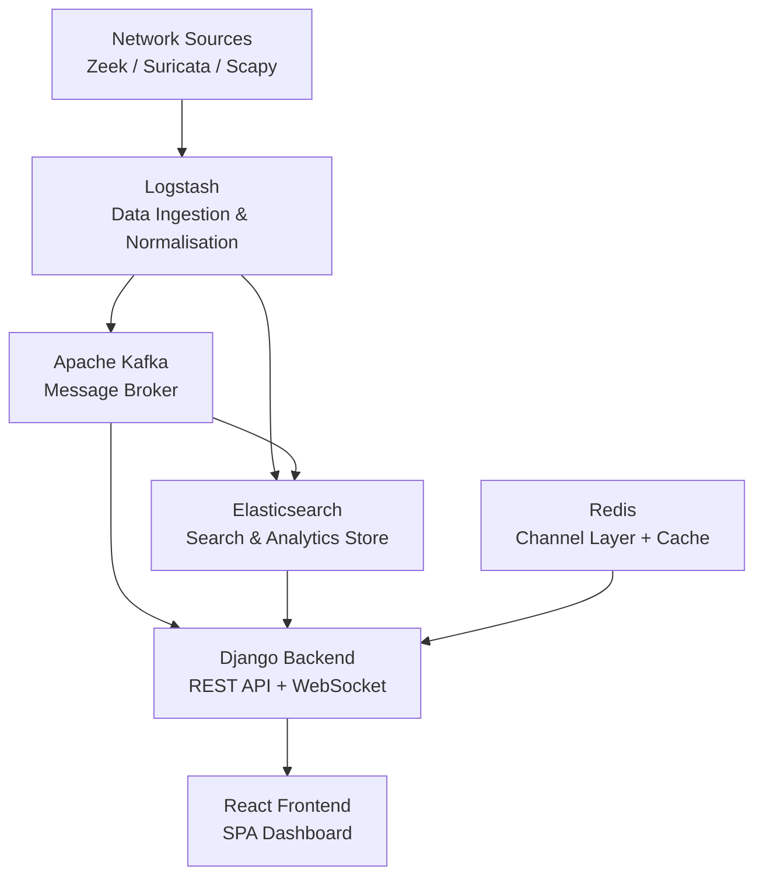
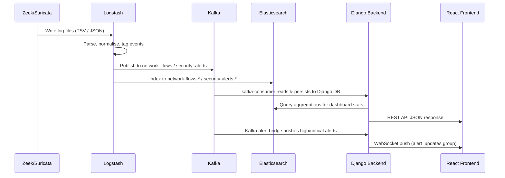

# Campus Network Security — Architecture & System Design

# Campus Network Security Monitoring System

## Architecture & System Design

<user_quoted_section>Project Type: Final Year Project (FYP) — Full-stack web application for real-time campus network security monitoring.</user_quoted_section>

## 1. High-Level Architecture Overview

The system is composed of five distinct layers that work together to ingest, process, store, and visualise network security data in real time.



## 2. Infrastructure & Deployment

All services are orchestrated via Docker Compose (file:docker-compose.yml). The full service inventory is:

| Container | Image | Port(s) | Role |
| --- | --- | --- | --- |
| `es-campus` | Elasticsearch 8.13.4 | 9200 | Search & analytics store |
| `kibana-campus` | Kibana 8.13.4 | 5601 | ES data exploration (dev) |
| `zk-campus` | Confluent Zookeeper 7.6.1 | — | Kafka coordination |
| `kafka-campus` | Confluent Kafka 7.6.1 | 9092 / 29092 | Message broker |
| `kafka-init-campus` | Confluent Kafka 7.6.1 | — | Topic bootstrapper (one-shot) |
| `logstash-campus` | Logstash 8.13.4 | 5044 / 9600 | Log ingestion & routing |
| `redis-campus` | Redis 7.2 | 6379 | Channel layer + optional cache |
| `backend-campus` | Custom Django image | 8000 | REST API + WebSocket server |
| `network-monitor-campus` | Custom Django image | — | Live packet capture (host network) |
| `kafka-consumer-campus` | Custom Django image | — | Kafka → Django DB consumer |
| `frontend-campus` | Custom React image | 3000 | SPA frontend |

### Kafka Topics

Core Kafka topics are pre-created by `kafka-init` (plus `network-logs` for the secondary Logstash pipeline):

| Topic | Partitions | Purpose |
| --- | --- | --- |
| `network_flows` | 3 | Zeek connection flow events |
| `security_alerts` | 3 | Suricata IDS alert events |
| `other_events` | 1 | Unclassified log events |
| `network-logs` | 1 | Suricata alert copy for `network.conf` → `campus-logs-*` in Elasticsearch |

## 3. Data Ingestion Pipeline

### 3.1 Log Sources

- **Zeek** — writes TSV-format connection logs to `/var/log/zeek/conn.log`
- **Suricata** — writes JSON EVE logs to `/var/log/suricata/eve.json`
- **Scapy** — live packet capture via the `network-monitor` container using `capture_traffic` management command on the `wlo1` interface

### 3.2 Logstash Processing

Two pipelines are defined in file:logstash/pipelines/:

**Pipeline 1** — `zeek_suricata_to_kafka_es.conf` (primary):

1. Reads Zeek TSV logs and Suricata JSON logs from mounted volumes
2. Parses Zeek TSV with Grok patterns; Suricata JSON is already structured
3. Normalises field names: `src_ip → source_ip`, `dest_ip → destination_ip`, etc.
4. Tags events as `network_flow` or `security_alert`
5. Routes to Kafka topic (`network_flows` or `security_alerts`) **and** Elasticsearch index (`network-flows-YYYY.MM.dd` or `security-alerts-YYYY.MM.dd`) simultaneously

**Pipeline 2** — `network.conf` (secondary):

- Consumes from Kafka topic `network-logs`
- Routes Suricata events to Elasticsearch index `campus-logs-YYYY.MM.dd`

### 3.3 Data Flow Sequence



## 4. Backend Architecture

### 4.1 Technology Stack

| Component | Technology |
| --- | --- |
| Framework | Django 4.2.7 + Django REST Framework 3.14 |
| ASGI Server | Daphne 4.1 |
| WebSocket | Django Channels 4.0 + channels-redis 4.1 |
| Authentication | JWT via `djangorestframework-simplejwt` 5.3 |
| Task Queue | Celery 5.3 (broker: Redis) |
| Database | SQLite (dev) / PostgreSQL (prod, via `USE_POSTGRES=True`) |
| Search/Analytics | Elasticsearch 8.13 client |
| Message Broker | confluent-kafka 2.5 |
| Packet Capture | Scapy 2.5 |
| Filtering | django-filter 23.5 |

### 4.2 Django Application Structure

The backend (file:backend/) is organised into focused Django apps under file:backend/apps/:

| App | Responsibility |
| --- | --- |
| `authentication` | Custom `User` model (RBAC), `AuditLog`, JWT login/register/logout |
| `dashboard` | Dashboard stats endpoint + WebSocket consumers |
| `network` | `NetworkTraffic` model, traffic capture & mock data commands |
| `alerts` | `SecurityAlert` model, alert CRUD, acknowledge/resolve actions |
| `threats` | `ThreatIntelligence` model, IOC management, IP reputation |
| `system` | `SystemSettings` model, health checks, Elasticsearch client |
| `stats` | Elasticsearch-backed aggregation endpoints (protocols, traffic, alerts) |
| `api` | Shared custom exception handler |
| `middleware` | `AuditLogMiddleware` (currently disabled) |

### 4.3 REST API Endpoints

| Prefix | App | Key Endpoints |
| --- | --- | --- |
| `/api/auth/` | authentication | `login/`, `register/`, `logout/`, `user/`, `users/` |
| `/api/dashboard/` | dashboard | `stats/` |
| `/api/network/` | network | `traffic/`, `traffic/protocols/`, `traffic/connections/` |
| `/api/alerts/` | alerts | `<id>/`, `<id>/acknowledge/`, `<id>/resolve/`, `timeline/` |
| `/api/threats/` | threats | `<id>/`, `search/`, `ip-reputation/` |
| `/api/system/` | system | `health/`, `settings/` |
| `/api/stats/` | stats | `protocols/`, `traffic/`, `alerts/` |
| `/api/health/` | system | Health check (unauthenticated) |

### 4.4 WebSocket Endpoints

Defined in file:backend/config/routing.py:

| Path | Consumer | Channel Group | Purpose |
| --- | --- | --- | --- |
| `ws/dashboard/` | `DashboardConsumer` | `dashboard_updates` | Live dashboard metric pushes |
| `ws/alerts/` | `AlertConsumer` | `alert_updates` | Real-time alert notifications |
| `ws/network/` | `NetworkConsumer` | `network_updates` | Network traffic stream |
| `ws/live/` | `NetworkLiveConsumer` | `network_live` | All live network events |

The `AlertConsumer` is backed by a **Kafka bridge thread** (`start_kafka_alert_bridge`) that consumes the `security_alerts` Kafka topic and pushes `high`/`critical` severity alerts to the `alert_updates` channel group in real time.

### 4.5 Authentication & Authorisation

- Custom `User` model (file:backend/apps/authentication/models.py) extends `AbstractUser`
- Three roles: `admin`, `analyst`, `viewer`
- Superusers are automatically assigned the `admin` role
- JWT tokens: access token (1 hour), refresh token (7 days), with rotation and blacklisting
- API default permission: `IsAuthenticated`
- Rate limiting: anonymous 100/hour, authenticated 1000/day

### 4.6 Data Models

**`User`** (`authentication`)

- Fields: `role`, `phone`, `department`, `avatar`, `last_login_ip`, timestamps
- Properties: `is_admin`, `is_analyst`

**`AuditLog`** (`authentication`)

- Fields: `user`, `action`, `resource_type`, `resource_id`, `description`, `ip_address`, `user_agent`
- Indexed on `(user, created_at)` and `(action, created_at)`

**`NetworkTraffic`** (`network`)

- Fields: `timestamp`, `source_ip`, `destination_ip`, `source_port`, `destination_port`, `protocol`, `bytes_sent`, `bytes_received`, `packets_sent`, `packets_received`, `connection_state`, `duration`, `application`, `country_code`
- Protocols: TCP, UDP, ICMP, HTTP, HTTPS, FTP, SSH, DNS, DHCP
- Indexed on `timestamp`, `source_ip`, `destination_ip`, `protocol`

**`SecurityAlert`** (`alerts`)

- Fields: `title`, `description`, `severity`, `alert_type`, `status`, `source_ip`, `destination_ip`, ports, `protocol`, `signature`, `rule_id`, `country_code`, `timestamp`, `acknowledged_by`, `resolved_by`, `notes`
- Severities: `critical`, `high`, `medium`, `low`
- Statuses: `new`, `acknowledged`, `resolved`, `false_positive`
- Alert types: intrusion, malware, DDoS, port scan, brute force, suspicious traffic, data exfiltration, unauthorised access

**`ThreatIntelligence`** (`threats`)

- Fields: `ioc_type`, `ioc_value`, `threat_type`, `description`, `reputation_score` (0–100), `source`, `first_seen`, `last_seen`, `country_code`, `latitude`, `longitude`, `tags` (JSON), `metadata` (JSON), `is_active`
- IOC types: IP, domain, URL, file hash, email
- Threat types: malware, phishing, botnet, C2, exploit, ransomware, trojan, spyware
- Unique constraint on `(ioc_type, ioc_value)`

**`SystemSettings`** (`system`)

- Key-value store for runtime configuration, categorised by `category`

### 4.7 Management Commands

| Command | App | Purpose |
| --- | --- | --- |
| `generate_mock_data` | network | Seed database with mock traffic & alerts |
| `generate_live_traffic` | network | Continuously generate synthetic traffic |
| `capture_traffic` | network | Live Scapy packet capture from a network interface |
| `simulate_pipeline` | network | Simulate the full Kafka/ES pipeline |
| `inject_es_traffic` | network | Inject test events directly into Elasticsearch |
| `consume_kafka` | system | Consume Kafka topics and persist to Django DB |
| `sync_threat_intel` | threats | Sync threat intelligence from external sources |
| `bootstrap_data` | dashboard | Bootstrap initial dashboard data |

## 5. Frontend Architecture

### 5.1 Technology Stack

| Component | Technology |
| --- | --- |
| Framework | React 18.2 + TypeScript 4.9 |
| UI Library | Material-UI (MUI) v5 + Emotion |
| Styling | Tailwind CSS 3.3 |
| Charts | Chart.js 4.4 + react-chartjs-2, Recharts 2.12, MUI X Charts |
| Animations | Framer Motion 12 |
| Routing | React Router v6 |
| HTTP Client | Axios 1.6 (with JWT interceptors & auto-refresh) |
| WebSocket | Socket.IO client 4.6 |
| Notifications | Sonner 1.7 (toast notifications) |
| i18n | i18next 23 + react-i18next |
| Icons | Lucide React, MUI Icons |

### 5.2 Application Structure

```
frontend/src/
├── App.tsx              # Root: providers, routing, real-time alert bridge
├── pages/               # Route-level page components
├── layouts/             # MainLayout (sidebar + navbar + outlet)
├── components/
│   ├── common/          # StatCard, GlassCard, SparkLine, AnimatedCounter, etc.
│   ├── dashboard/       # NetworkFlowAnimation
│   └── layout/          # Navbar, Sidebar
├── contexts/            # AuthContext, ThemeContext, ToastContext
├── hooks/               # useApi, useAlertWebSocket, useDebounce
├── services/            # api.ts (ApiService class)
├── types/               # TypeScript interfaces
├── locales/             # i18n JSON files (en, ru, ky, kz, tj)
└── config/              # Chart.js global config
```

### 5.3 Pages & Routes

| Route | Page | Access |
| --- | --- | --- |
| `/login` | `Login` | Public |
| `/register` | `Register` | Public |
| `/` | `Dashboard` | Authenticated |
| `/network` | `NetworkTraffic` | Authenticated |
| `/alerts` | `SecurityAlerts` | Authenticated |
| `/threats` | `ThreatIntelligence` | Authenticated |
| `/settings` | `Settings` | Admin only |
| `/users` | `UserManagement` | Admin only |

All protected routes are wrapped in `PrivateRoute`; admin-only routes use `AdminRoute`. All pages are **lazy-loaded** for performance.

### 5.4 API Service Layer

file:frontend/src/services/api.ts exposes a singleton `ApiService` class with:

- Axios instance with base URL resolution (env var → same-origin `/api` fallback)
- Request interceptor: attaches `Bearer` JWT token from `localStorage`
- Response interceptor: automatic token refresh on 401, redirect to `/login` on refresh failure
- Named service exports: `authService`, `dashboardService`, `networkService`, `alertsService`, `threatsService`, `statsService`, `systemService`, `userManagementService`

### 5.5 Real-Time Alert Bridge

`RealtimeAlertBridge` (in file:frontend/src/App.tsx) uses the `useAlertWebSocket` hook to maintain a WebSocket connection to `ws/alerts/`. On receiving a `high` or `critical` alert, it fires a Sonner toast notification with severity-appropriate styling.

### 5.6 Internationalisation

Five locales are supported via file:frontend/src/locales/:

| Code | Language |
| --- | --- |
| `en` | English |
| `ru` | Russian |
| `ky` | Kyrgyz |
| `kz` | Kazakh |
| `tj` | Tajik |

## 6. Cross-Cutting Concerns

### 6.1 Security

- JWT authentication with short-lived access tokens (1 hour) and rotating refresh tokens (7 days)
- CORS restricted to configured origins (default: `localhost:3000`)
- API rate limiting (anonymous: 100/hour, user: 1000/day)
- Role-based access control enforced at both API and frontend route levels
- `AuditLog` model tracks user actions (middleware currently disabled)
- Password validation enforces Django's built-in validators

### 6.2 Caching

- **Development:** `LocMemCache` (in-process, no Redis required)
- **Production:** Redis cache (enabled via `USE_REDIS=True`)
- Channel layer always uses Redis for WebSocket group messaging

### 6.3 Observability

- `drf-yasg` — Swagger/ReDoc API documentation at `/api/docs/` and `/api/redoc/` (enabled in `INSTALLED_APPS`; optional in other environments)
- `django-prometheus` — Prometheus metrics endpoint
- `AuditLogMiddleware` — per-request audit logging

### 6.4 Database Strategy

- **Development:** SQLite (zero-config, auto-created as `db.sqlite3`)
- **Production:** PostgreSQL (enabled via `USE_POSTGRES=True` + env vars `DB_NAME`, `DB_USER`, `DB_PASSWORD`, `DB_HOST`, `DB_PORT`)

## 7. Environment Configuration

Key environment variables (configured via `.env` or Docker Compose):

| Variable | Default | Purpose |
| --- | --- | --- |
| `SECRET_KEY` | insecure default | Django secret key |
| `DEBUG` | `True` | Debug mode |
| `ALLOWED_HOSTS` | `localhost,127.0.0.1` | Allowed HTTP hosts |
| `CORS_ALLOWED_ORIGINS` | `http://localhost:3000` | CORS whitelist |
| `USE_POSTGRES` | `False` | Switch to PostgreSQL |
| `USE_REDIS` | `False` | Switch cache to Redis |
| `REDIS_HOST` / `REDIS_PORT` | `127.0.0.1` / `6379` | Redis connection |
| `ELASTICSEARCH_HOST` | `http://localhost:9200` | ES connection |
| `KAFKA_BOOTSTRAP_SERVERS` | `localhost:9092` | Kafka connection |
| `ABUSEIPDB_API_KEY` | mock key | IP reputation API |

## 8. Key Architectural Decisions

| Decision | Choice | Rationale |
| --- | --- | --- |
| ASGI server | Daphne | Required for Django Channels WebSocket support |
| Message broker | Apache Kafka | Decouples log ingestion from processing; handles high-throughput event streams |
| Search store | Elasticsearch | Efficient aggregations for time-series network data; daily rolling indices |
| Real-time transport | Django Channels + Redis | Native Django WebSocket support with group broadcasting |
| Auth strategy | JWT (SimpleJWT) | Stateless, suitable for SPA; refresh token rotation for security |
| Frontend bundler | Create React App | Simplicity for FYP; includes dev proxy to backend |
| Database (dev) | SQLite | Zero-config for development and demonstration |
| Packet capture | Scapy | Pure-Python, no external binary dependency for live capture |